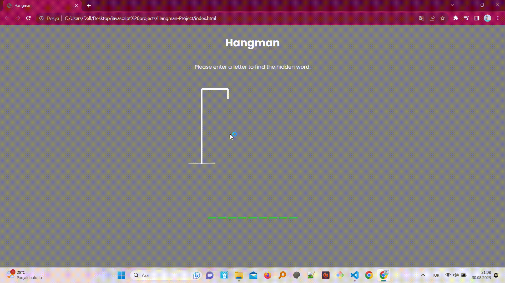

<h2>The name of the project</h2>

JavaScript-Hangman-Game

<h3>The aim of the project</h3>

Welcome to the Hangman Game project! This is a classic word-guessing game implemented using JavaScript. The goal of the game is to guess the correct word by suggesting individual letters within a certain number of attempts.

<h4>The technologies-tools used for this project</h4>

Html,Css and Javascript

<h5>The screen of the project</h5>

